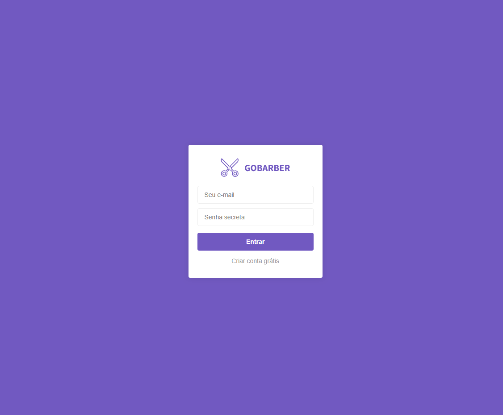
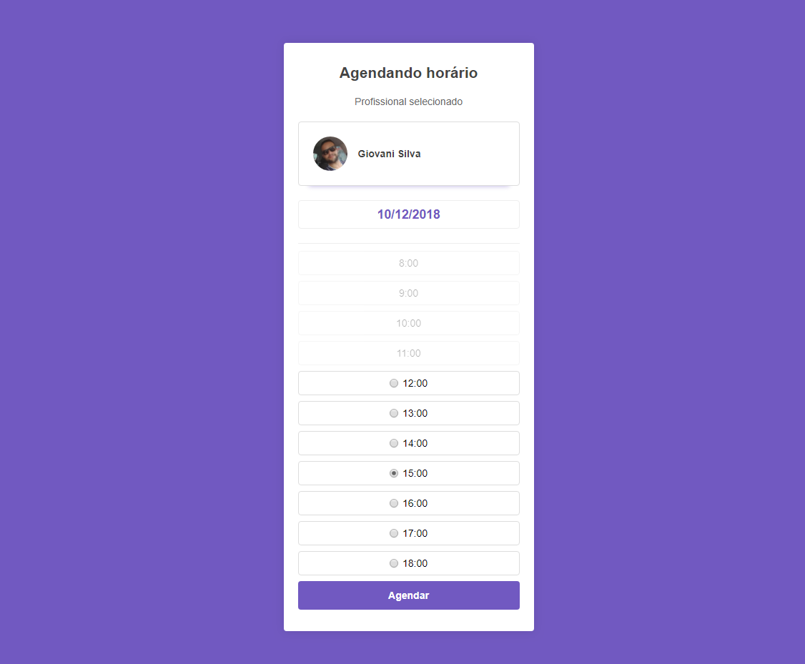
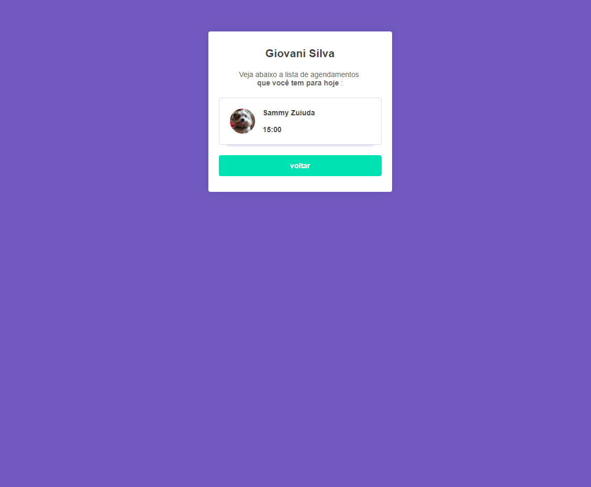

# GOBARBER

Aplicação MVC Node, Express, Nunjucks, PostGres

- Usuário poder agendar um serviço com o prestador, vetando serviços marcados no mesmo horário, ou em horários que já passaram.

- Seção para o prestador de serviços acompanhar os agendamentos do dia programados com ele. Essa seção deve incluir as informações do usuário que agendou e também o horário do agendamento.

## Install

- clone repo
- install dependecies, run into terminal `yarn`
- install PostGress
- access vars in `database.js`
- run sequelize migration `npx sequelize db:migrate`
- run `yarn start` access in your browser `localhost:3000`

> "Não espere para plantar, apenas tenha paciência para colher"
